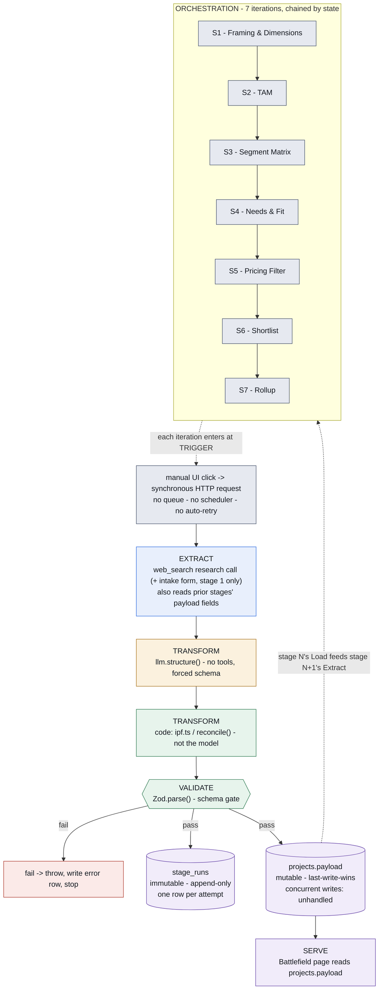
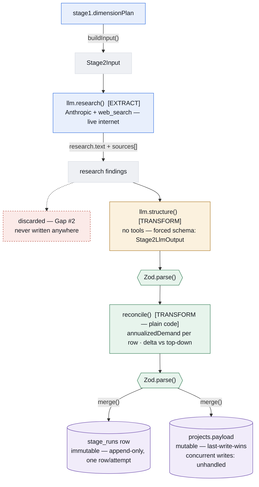
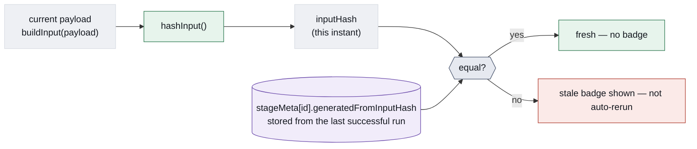

# Architecture: layers, not just steps

*Rev. 2.* Rev. 1 colored all seven business stages the same way and called that
"data engineering." It wasn't — it was a flowchart of product steps. This version
treats extract / transform / validate / load / serve as the actual structural
axis, and the seven stages as what they are: one orchestration sequence running
that same shape seven times, chained by state. Also published as an interactive
diagram (link shared in chat).

## 1. The canonical shape, run seven times

Every stage — framing, TAM, segmentation, needs, pricing, shortlist, rollup —
passes through the same six layers. What differs between them is only the
content of the extract/transform calls. Orchestration is what chains them:
stage N's Load output becomes stage N+1's Extract input by re-reading the
shared payload — there's no message queue or event bus, it's a synchronous
HTTP call per stage, with no automatic retry.

The one visual exception to "same shape every time": stage 3 adds a second
deterministic transform (`ipf.ts`, the matrix-fill), and stages that don't need
grounding (6, 7) skip the Extract layer's web-search sub-step — they transform
straight from payload state.

## 2. Anatomy of one stage, with the gates made explicit

Same TAM example as rev. 1, corrected: schema validation is now its own gate
rather than a caption, and the two storage nodes are labeled with their actual
consistency properties instead of just "where it's saved."

Every field written into `Stage2Output` is also a `sourcedValue` — tagged
`sourced`, `modeled`, or `assumed`, plus an optional URL — a data-quality
dimension orthogonal to the schema-shape validation the two gates above
enforce.

## 3. Change detection: how a stage knows it's stale

The one mechanism in this system that's genuinely a data-engineering pattern in
its own right — content-hash-based staleness detection, the same idea behind
CDC watermarking or dbt's state comparison, just not wired to auto-recompute yet.

This is a real, deliberate incremental-recompute mechanism — but the last step
is manual today: a stale badge tells the user something upstream changed, it
doesn't trigger recomputation itself. That's part of Gap #1.

## 4. Collect / Transform / Output, in one dictionary

**Extract** — what's ingested
- `intake` form — category, geography, brand, description (stage 1 only)
- `llm.research()` — live web search per grounded stage (1–6)
- upstream `ProjectPayload` fields — every stage's `buildInput()`

**Transform / Validate** — how it's processed
- `llm.structure()` — forces findings into a Zod schema, no tools
- `ipf.ts` / `reconcile()` — deterministic code, not the model
- `Zod.parse()` — schema gate, twice per grounded stage
- `sourcedValue` tagging — sourced / modeled / assumed on every fact
- `hashInput()` — content hash feeding staleness detection

**Load / Serve** — where it lands
- `money_mountain.stage_runs` — immutable, append-only, one row/attempt
- `money_mountain.projects.payload` — mutable, last-write-wins, concurrent writes unhandled
- Battlefield page — bar chart, top pick, ranked table, the user-facing consumer

## Known gaps

See `NOTES.md` for full detail. Summary:

1. **No auto-chain** — orchestration is a manual click per stage, and staleness
   detection (§3) surfaces a badge but doesn't trigger recomputation.
   Deliberate for the MVP (let us debug the DB/framework/timeout issues one
   stage at a time), but the end state is one input running all 7 iterations
   without manual clicks in between.
2. **The research pass is invisible** — `research.text` and its sources feed
   `structure()` and are then discarded, never written to `stage_runs`, never
   shown in the UI. Marked directly on diagram §2 above.

---
*Rev. 2, 2026-08-20 — revised after self-critique against actual data-engineering
conventions. Reflects the shipped pipeline after the first live Anthropic run.*
