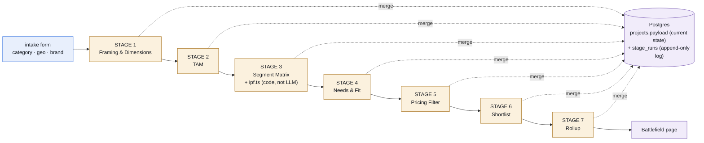
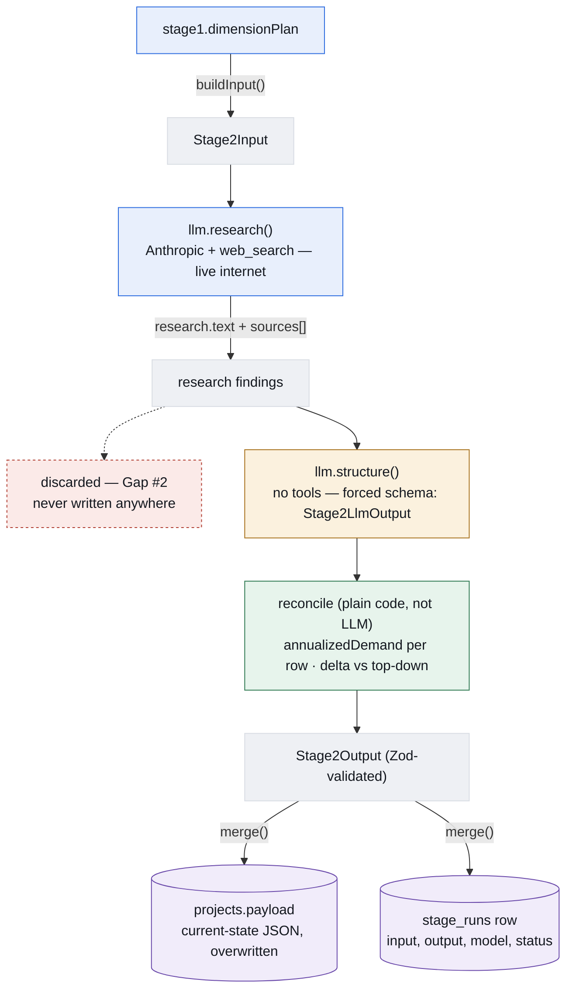

# Architecture: what gets collected, transformed, and written out

Also published as a diagram: see the artifact link shared in chat (not linkable from
Markdown — ask in the conversation if you need it again). This file is the
versioned, GitHub-renderable equivalent.

## 1. The pipeline as a DAG

Each stage reads the accumulated project payload, drafts its own piece, then merges
its output back in for the next stage to read. Every stage also writes an audit-log
row before touching the shared payload.

Every arrow between stages is really `ProjectPayload` passed forward — stage N's
`buildInput()` reads the fields the stages before it wrote. Stage 3 is the one
exception to "AI drafts, code just moves data": its interior matrix cells are
filled by a deterministic function, not the model. Stages currently run one
"Generate" click at a time, left to right — see Gap #1 below.

## 2. Anatomy of one stage

Zooming into Stage 2 (TAM) as a representative example — the actual shape of
every web-search-grounded stage (1 through 6). Two sequential Anthropic calls,
not one agent looping freely: a research pass, then a structuring pass, kept
separate because mixing a tool-using turn with a forced structured final answer
isn't a documented-safe combination.

Every field written into `Stage2Output` is a `sourcedValue` — a number or claim
tagged `sourced`, `modeled`, or `assumed`, plus an optional URL — so the payload
always carries its own evidence trail, not just a final figure.

## 3. Collect / Transform / Output, in one dictionary

**Collect** — what's ingested
- `intake` form — category, geography, brand, description (seeds stage 1)
- `llm.research()` — live web search per grounded stage (1–6)
- upstream `ProjectPayload` fields — each stage's `buildInput()`

**Transform** — how it's processed
- `llm.structure()` — forces findings into a Zod schema, no tools
- `ipf.ts` — deterministic matrix fill (stage 3 only, not the model)
- `merge()` — folds each stage's output back into the payload
- `sourcedValue` tagging — sourced / modeled / assumed on every fact

**Output** — where it lands
- `money_mountain.projects.payload` — current state, Postgres jsonb
- `money_mountain.stage_runs` — append-only attempt log
- Battlefield page — bar chart, top pick, ranked table, the user-facing sink

## Known gaps

See `NOTES.md` for full detail. Summary:

1. **No auto-chain** — stages run one "Generate" click at a time. Deliberate for
   the MVP (let us debug the DB/framework/timeout issues one stage at a time),
   but the end state is one input running all 7 stages without manual clicks
   in between.
2. **The research pass is invisible** — `research.text` and its sources feed
   `structure()` and are then discarded, never written to `stage_runs`, never
   shown in the UI. When a stage's output looks wrong, there's currently no way
   to see what it actually searched for or found.

---
*Reflects the shipped pipeline after the first live Anthropic run, 2026-08-20.*
